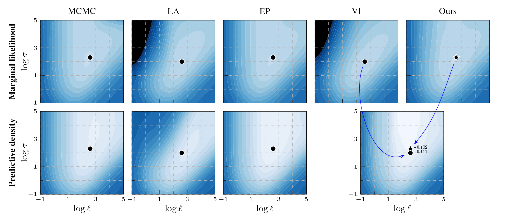

# Improving Hyperparameter Learning under Approximate Inference in Gaussian Process Models

This repository is the official implementation of the methods in the publication:

* Rui Li, S.T. John, and Arno Solin (2023). **Improving hyperparameter learning under approximate inference in Gaussian process models**. In *International Conference on Machine Learning (ICML)*. [[arXiv preprint]](https://arxiv.org/abs/2306.04201)

The paper aims at improving hyperparameter learning in GP models by focusing on the interplay between variational inference (VI) and the learning target. Instead of using the evidence lower bound (ELBO) both for *inferring* variational parameters and *learning* hyperparameters, we show that a direct approximation of the marginal likelihood as in Expectation Propagation (EP) is a better learning objective for hyperparameter optimization.


*Example of log marginal likelihood / predictive density surfaces for the ionosphere data set by varying kernel magnitude σ and lengthscale ℓ. The colour scale is the same in all plots (-0.8...0) (normalized by #data). Optimal hyperparameters shown by a black marker. EP and our EP-like marginal likelihood estimation match the MCMC baseline better than VI or LA, thus providing a learning proxy. For prediction, our method still leverages the same variational representation as VI.*

The `python` folder contains the Python experiments code. See the main paper and appendix for details on the baseline methods and the original publications. The reference implementation of our method is based on [t-SVGP](https://github.com/AaltoML/t-SVGP) and the benchmarking setup is built on top of [Bayesian benchmarks](https://github.com/secondmind-labs/bayesian_benchmarks/).
For evaluating (older) baseline methods, the `matlab` folder contains the Mathworks Matlab code for:
1. MCMC estimation of log marginal likelihood and log predictive density
2. LA and EP implementation for Student-t regression

## Environment

### Python
We recommend using Python version 3.10.4. To install dependencies:
```
pip install -r requirement.txt
```

Alternatively, use [Conda](https://www.anaconda.com/download) to creat a Python virtual environment by
```
conda env create --file python/env.yaml
```

### Matlab
We used Matlab (The MathWorks, Inc.) R2021a. The code in `matlab/contour/` uses the [GPML toolbox v. 4.2](http://gaussianprocess.org/gpml/code/matlab/doc/), and the code in `matlab/experiment/` requires the [GPstuff toolbox](https://github.com/gpstuff-dev/gpstuff/tree/c7d797d8ff09da845613165b0f94030e36d501e5). Check that the toolboxes are included in your path (look for `addpath /path/to/gpstuff` and `addptah path/to/gpml`, respectively).

### SLURM
We ran our experiments on a SLURM-based compute cluster. The instructions below assume such a SLURM environment, but the experiments can in principle be run sequentially by locally running the submission scripts with the corresponding values of the `$SLURM_ARRAY_TASK_ID` environment variable set to all values in the (inclusive) range defined by the `#SBATCH --array=<start>,<end>` line of a submission script.

## Our method and example usage 

Implementation for our methods are in `src` folder. We include a 2D classification example in `example/classification.ipynb` to show how to use our methods for better hyperparameter estimation in GP. We include both the full GP and sparse GP in the example.

## Reproduce results in the paper

### Figures

#### Fig. 1 and Fig. 2
To reproduce Fig. 1 and Fig. 2 in the paper:
* Enter the `python/experiments/contour-plots` folder, activate Python environment in slurm, run
  ```bash
  sbatch slurmscript_fig1_python.sh
  ```
  
* Enter the `matlab/contour-plots` folder, activate Matlab environment in slurm, run
  ```bash
  bash run_lml.sh
  bash run_lp.sh
  ```
  
* Wait for all your jobs to finish (for MCMC this could take around 20 hours; you can reduce the runtime in exchange for a noisier surface by reducing the values of `N`, `Ns`, `Nb`).

* Go to the `python/experiments/contour-plots` folder and run
  ```bash
  python collect_mcmc_result.py
  ```

* Go to the `python/notebooks-for-reproducing-figs` folder, run the `reproduce_fig_1_and_fig_2.ipynb` notebook.

#### Fig. 3
The code for generating this figure relies on the results from Figs. 1 and 2 above.
To reproduce Fig. 3 in the paper:

* Enter the `python/experiments/sparse-contour-plots` folder, activate Python environment in slurm, run
  ```bash
  sbatch slurmscript_fig3.sh
  ```

* Go to the `python/notebooks-for-reproducing-figs` folder, run the `reproduce_fig_3.ipynb` notebook.

#### Fig. 4
To reproduce Fig. 4 in the paper:
* Enter the `python/experiments/classification` folder, activate Python environment in slurm, run
  ```bash
  bash submit_jobs_table_1.sh
  ```

* Run `python process_result.py` to collect the results

* Go to the `python/notebooks-for-reproducing-figs` folder, run the `reproduce_fig_4.ipynb` notebook

#### Fig. 5
To reproduce Fig. 5 in the paper:
* Enter the `python/experiment/conflict-training-obj` folder, activate Python environment in slurm, run
  ```bash
  bash submit_jobs_fig5.sh
  ```

* Go to the `python/notebooks-for-reproducing-figs` folder, run the `reproduce_fig_5.ipynb` notebook.

### Tables

#### Table 1
To reproduce results in Table 1 in the paper:
* For LA, EP, VI and Ours results, enter the `python/experiment/classification` folder, activate Python environment in slurm, run
  ```bash
  bash submit_jobs_table_1.sh
  ```

* For MCMC results, enter the  `matlab/classification` folder. We use the same splits as in Python. To generate those splits, you can run `python generate_matlab_data.py` in the `python/experiments/classification` folder. These have have also been pre-generated and can be downloaded as zipped mat files from [Google Drive](https://drive.google.com/file/d/1hhx3wzdDtTmpKgdb6isPr5EJ7lDO8UeN/view?usp=sharing). Unzip the file and place it under the experiments folder in a new folder named `data`. Then, activate the Matlab environment in slurm and run
  ```bash
  bash submit_mcmc.sh
  ```

#### Table 2
To reproduce results in Table 2 in the paper:
* For VI and Ours results, enter the `python/experiments/student-t` folder, activate Python environment in slurm, run
  ```bash
  bash submit_jobs_table_2.sh
  ```
  
* For LA, EP and MCMC results, enter the `matlab/student-t` folder. Then, activate Matlab environment in slurm, run
  ```bash
  sbatch run_mcmc_student_t.sh
  ```

#### Table 3
To reproduce results in Table 3 in the paper:
* Enter the `python/experiment/classification` folder, activate Python environment in slurm, run
  ```bash
  bash submit_jobs_table_3.sh
  ```

## License

This software is provided under the [MIT license](LICENSE).
